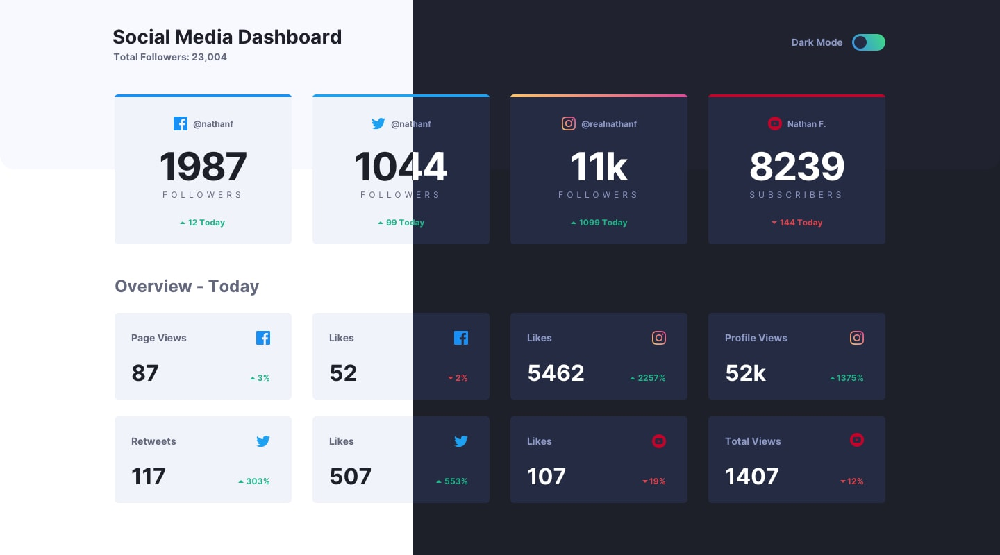

# MNGR - Social Media Dashboard

This is a solution to the [Social media dashboard with theme switcher challenge on Frontend Mentor](https://www.frontendmentor.io/challenges/social-media-dashboard-with-theme-switcher-6oY8ozp_H).

## Table of contents

- [Overview](#overview)
- [Links](#links)
- [My process](#my-process)
- [Built with](#built-with)
- [Author](#author)

## Overview

Users should be able to:

- View the optimal layout for the site depending on their device's screen size
- See hover states for all interactive elements on the page
- Toggle color theme to their preference

### Dark / Light theme toggle

### Links

- Live Site URL -> [Add live site URL here](https://mngr-dashboard.netlify.app)

## My process

### Built with

- Semantic HTML5 markup
- CSS custom properties
- Flexbox
- CSS Grid
- Mobile-first workflow
- [React](https://reactjs.org/) - JS library
- [TailwindCSS](https://tailwindcss.com/)
- [Vite](https://vitejs.dev/)

## Author

- Frontend Mentor - [@atanasovCode](https://www.frontendmentor.io/profile/AtanasovCode)
